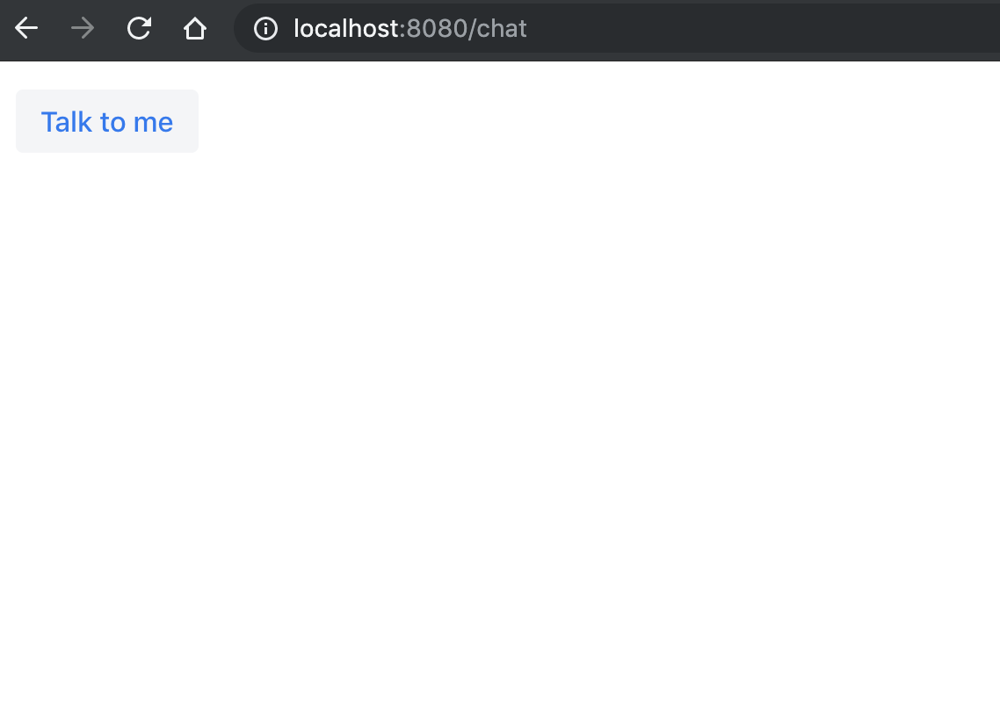

run
----

```bash
mvn jetty:run
[INFO] Scanning for projects...
[INFO] 
[INFO] ------------------------------------------------------------------------
[INFO] Building chatbot-ui 1.0-SNAPSHOT
[INFO] ------------------------------------------------------------------------
[INFO] 
[INFO] >>> jetty-maven-plugin:9.4.19.v20190610:run (default-cli) > test-compile @ chatbot-ui >>>
[INFO] 
[INFO] --- frontend-maven-plugin:1.8.0:install-node-and-npm (install node and npm) @ chatbot-ui ---
[INFO] Node v10.16.3 is already installed.
[INFO] 
[INFO] --- maven-resources-plugin:2.6:resources (default-resources) @ chatbot-ui ---
[INFO] Using 'UTF-8' encoding to copy filtered resources.
[INFO] Copying 0 resource
[INFO] 
[INFO] --- vaadin-maven-plugin:14.0.4:prepare-frontend (default) @ chatbot-ui ---
[INFO] 
[INFO] --- maven-compiler-plugin:3.8.0:compile (default-compile) @ chatbot-ui ---
[INFO] Nothing to compile - all classes are up to date
[INFO] 
[INFO] --- maven-resources-plugin:2.6:testResources (default-testResources) @ chatbot-ui ---
[INFO] Using 'UTF-8' encoding to copy filtered resources.
[INFO] Copying 0 resource
[INFO] 
[INFO] --- maven-compiler-plugin:3.8.0:testCompile (default-testCompile) @ chatbot-ui ---
[INFO] Nothing to compile - all classes are up to date
[INFO] 
[INFO] <<< jetty-maven-plugin:9.4.19.v20190610:run (default-cli) < test-compile @ chatbot-ui <<<
[INFO] 
[INFO] 
[INFO] --- jetty-maven-plugin:9.4.19.v20190610:run (default-cli) @ chatbot-ui ---
[INFO] Logging initialized @5423ms to org.eclipse.jetty.util.log.Slf4jLog
[INFO] webAppSourceDirectory not set. Trying src/main/webapp
[INFO] webAppSourceDirectory /Users/a1353612/soundofmusic/compile1010/chatbot-ui/src/main/webapp does not exist. Trying /Users/a1353612/soundofmusic/compile1010/chatbot-ui/target/webapp-tmp
[INFO] Reload Mechanic: automatic
[INFO] nonBlocking:false
[INFO] Classes = /Users/a1353612/soundofmusic/compile1010/chatbot-ui/target/classes
[INFO] Configuring Jetty for project: chatbot-ui
[INFO] Context path = /
[INFO] Tmp directory = /Users/a1353612/soundofmusic/compile1010/chatbot-ui/target/tmp
[INFO] Web defaults = org/eclipse/jetty/webapp/webdefault.xml
[INFO] Web overrides =  none
[INFO] web.xml file = null
[INFO] Webapp directory = /Users/a1353612/soundofmusic/compile1010/chatbot-ui/target/webapp-tmp
[INFO] jetty-9.4.19.v20190610; built: 2019-06-10T16:30:51.723Z; git: afcf563148970e98786327af5e07c261fda175d3; jvm 12.0.1+12
[INFO] Scanning elapsed time=392ms
[INFO] Initializing AtmosphereFramework
[main] INFO com.vaadin.flow.server.startup.DevModeInitializer - Starting dev-mode updaters in /Users/a1353612/soundofmusic/compile1010/chatbot-ui folder.
[main] INFO dev-updater - Scanning classes to find frontend configurations and dependencies...
[main] INFO dev-updater - Visited 661 classes. Took 696 ms.
[main] INFO dev-updater - Skipping `npm install`.
[main] INFO dev-updater - Copying frontend resources from jar files ...
[main] INFO dev-updater - Visited 9 resources. Took 52 ms.
[main] INFO dev-updater - No js modules to update
[main] INFO dev-webpack - Starting webpack-dev-server, port: 62234 dir: /Users/a1353612/soundofmusic/compile1010/chatbot-ui
   /Users/a1353612/soundofmusic/compile1010/chatbot-ui/node/node /Users/a1353612/soundofmusic/compile1010/chatbot-ui/node_modules/webpack-dev-server/bin/webpack-dev-server.js --config /Users/a1353612/soundofmusic/compile1010/chatbot-ui/webpack.config.js --port 62234 -d --inline=false
[webpack] INFO dev-webpack - ℹ ｢wds｣: Project is running at http://localhost:62234/webpack-dev-server/
[webpack] INFO dev-webpack - ℹ ｢wds｣: webpack output is served from /
[webpack] INFO dev-webpack - ℹ ｢wds｣: Content not from webpack is served from /Users/a1353612/soundofmusic/compile1010/chatbot-ui/target/classes/META-INF/VAADIN, src/main/webapp
[webpack] INFO dev-webpack -          Serving the 'stats.json' file dynamically.
[webpack] INFO dev-webpack - ℹ ｢wdm｣: Hash: 25e11c26e64a3a0cfdc3
[webpack] INFO dev-webpack - Version: webpack 4.30.0
[webpack] INFO dev-webpack - Time: 1974ms
[webpack] INFO dev-webpack - Built at: 11/22/2019 7:32:52 AM
[webpack] INFO dev-webpack -                                                                      Asset       Size      Chunks                    Chunk Names
[webpack] INFO dev-webpack -                          build/vaadin-bundle-52bc563ccb9911a15c63.cache.js   1.84 MiB      bundle  [emitted]         bundle
[webpack] INFO dev-webpack -                      build/vaadin-bundle.es5-3a94792eff1ad44081d8.cache.js   2.07 MiB  bundle.es5  [emitted]  [big]  bundle.es5
[webpack] INFO dev-webpack -                                           build/webcomponentsjs/LICENSE.md   1.52 KiB              [emitted]         
[webpack] INFO dev-webpack -                                            build/webcomponentsjs/README.md   10.5 KiB              [emitted]         
[webpack] INFO dev-webpack -                          build/webcomponentsjs/bundles/webcomponents-ce.js   19.5 KiB              [emitted]         
[webpack] INFO dev-webpack -                      build/webcomponentsjs/bundles/webcomponents-ce.js.map    129 KiB              [emitted]         
[webpack] INFO dev-webpack -                    build/webcomponentsjs/bundles/webcomponents-sd-ce-pf.js    113 KiB              [emitted]         
[webpack] INFO dev-webpack -                build/webcomponentsjs/bundles/webcomponents-sd-ce-pf.js.map    675 KiB              [emitted]         
[webpack] INFO dev-webpack -                       build/webcomponentsjs/bundles/webcomponents-sd-ce.js   84.8 KiB              [emitted]         
[webpack] INFO dev-webpack -                   build/webcomponentsjs/bundles/webcomponents-sd-ce.js.map    548 KiB              [emitted]         
[webpack] INFO dev-webpack -                          build/webcomponentsjs/bundles/webcomponents-sd.js   66.2 KiB              [emitted]         
[webpack] INFO dev-webpack -                      build/webcomponentsjs/bundles/webcomponents-sd.js.map    419 KiB              [emitted]         
[webpack] INFO dev-webpack -                       build/webcomponentsjs/custom-elements-es5-adapter.js  950 bytes              [emitted]         
[webpack] INFO dev-webpack -                                         build/webcomponentsjs/package.json    2.4 KiB              [emitted]         
[webpack] INFO dev-webpack - build/webcomponentsjs/src/entrypoints/custom-elements-es5-adapter-index.js  659 bytes              [emitted]         
[webpack] INFO dev-webpack -        build/webcomponentsjs/src/entrypoints/webcomponents-bundle-index.js   1.66 KiB              [emitted]         
[webpack] INFO dev-webpack -            build/webcomponentsjs/src/entrypoints/webcomponents-ce-index.js  675 bytes              [emitted]         
[webpack] INFO dev-webpack -         build/webcomponentsjs/src/entrypoints/webcomponents-sd-ce-index.js  860 bytes              [emitted]         
[webpack] INFO dev-webpack -      build/webcomponentsjs/src/entrypoints/webcomponents-sd-ce-pf-index.js   1.22 KiB              [emitted]         
[webpack] INFO dev-webpack -            build/webcomponentsjs/src/entrypoints/webcomponents-sd-index.js  767 bytes              [emitted]         
[webpack] INFO dev-webpack -                              build/webcomponentsjs/webcomponents-bundle.js    114 KiB              [emitted]         
[webpack] INFO dev-webpack -                          build/webcomponentsjs/webcomponents-bundle.js.map    677 KiB              [emitted]         
[webpack] INFO dev-webpack -                              build/webcomponentsjs/webcomponents-loader.js   6.13 KiB              [emitted]         
[webpack] INFO dev-webpack - Entrypoint bundle = build/vaadin-bundle-52bc563ccb9911a15c63.cache.js
[webpack] INFO dev-webpack - Entrypoint bundle.es5 [big] = build/vaadin-bundle.es5-3a94792eff1ad44081d8.cache.js
[webpack] INFO dev-webpack - [../node_modules/@vaadin/flow-frontend/flow-component-renderer.js] 7.34 KiB {bundle.es5} [built]
[webpack] INFO dev-webpack - [../node_modules/@vaadin/flow-frontend/flow-component-renderer.js] 5.08 KiB {bundle} [built]
[webpack] INFO dev-webpack - [../node_modules/@vaadin/vaadin-button/theme/lumo/vaadin-button.js] 72 bytes {bundle.es5} [built]
[webpack] INFO dev-webpack - [../node_modules/@vaadin/vaadin-button/theme/lumo/vaadin-button.js] 72 bytes {bundle} [built]
[webpack] INFO dev-webpack - [../node_modules/@vaadin/vaadin-lumo-styles/color.js] 7.63 KiB {bundle.es5} [built]
[webpack] INFO dev-webpack - [../node_modules/@vaadin/vaadin-lumo-styles/color.js] 7.43 KiB {bundle} [built]
[webpack] INFO dev-webpack - [../node_modules/@vaadin/vaadin-lumo-styles/icons.js] 87 bytes {bundle.es5} [built]
[webpack] INFO dev-webpack - [../node_modules/@vaadin/vaadin-lumo-styles/icons.js] 87 bytes {bundle} [built]
[webpack] INFO dev-webpack - [../node_modules/@vaadin/vaadin-lumo-styles/sizing.js] 679 bytes {bundle.es5} [built]
[webpack] INFO dev-webpack - [../node_modules/@vaadin/vaadin-lumo-styles/sizing.js] 664 bytes {bundle} [built]
[webpack] INFO dev-webpack - [../node_modules/@vaadin/vaadin-lumo-styles/spacing.js] 1.29 KiB {bundle.es5} [built]
[webpack] INFO dev-webpack - [../node_modules/@vaadin/vaadin-lumo-styles/spacing.js] 1.27 KiB {bundle} [built]
[webpack] INFO dev-webpack - [../node_modules/@vaadin/vaadin-lumo-styles/style.js] 1.24 KiB {bundle.es5} [built]
[webpack] INFO dev-webpack - [../target/frontend/generated-flow-imports.js] 770 bytes {bundle.es5} [built]
[webpack] INFO dev-webpack - [../target/frontend/generated-flow-imports.js] 772 bytes {bundle} [built]
[webpack] INFO dev-webpack -     + 175 hidden modules
[webpack] INFO dev-webpack - ℹ ｢wdm｣: Compiled successfully.
[webpack] INFO dev-webpack - 
----------------- Frontend compiled successfully. -----------------
[INFO] DefaultSessionIdManager workerName=node0
[INFO] No SessionScavenger set, using defaults
[INFO] node0 Scavenging every 660000ms
[main] INFO com.vaadin.flow.server.startup.ServletDeployer - Automatically deploying Vaadin servlet with name com.vaadin.flow.server.startup.ServletDeployer to /*
[main] INFO org.atmosphere.cpr.AtmosphereFramework - Installed AtmosphereHandler com.vaadin.flow.server.communication.PushAtmosphereHandler mapped to context-path: /*
[main] INFO org.atmosphere.cpr.AtmosphereFramework - Installed the following AtmosphereInterceptor mapped to AtmosphereHandler com.vaadin.flow.server.communication.PushAtmosphereHandler
[main] INFO org.atmosphere.cpr.AtmosphereFramework - Atmosphere is using org.atmosphere.util.VoidAnnotationProcessor for processing annotation
[main] INFO org.atmosphere.util.ForkJoinPool - Using ForkJoinPool  java.util.concurrent.ForkJoinPool. Set the org.atmosphere.cpr.broadcaster.maxAsyncWriteThreads to -1 to fully use its power.
[main] INFO org.atmosphere.cpr.AtmosphereFramework - Installed WebSocketProtocol org.atmosphere.websocket.protocol.SimpleHttpProtocol 
[main] INFO org.atmosphere.container.JSR356AsyncSupport - JSR 356 Mapping path 
[main] INFO org.atmosphere.cpr.AtmosphereFramework - Installing Default AtmosphereInterceptors
[main] INFO org.atmosphere.cpr.AtmosphereFramework - 	org.atmosphere.interceptor.CorsInterceptor : CORS Interceptor Support
[main] INFO org.atmosphere.cpr.AtmosphereFramework - 	org.atmosphere.interceptor.CacheHeadersInterceptor : Default Response's Headers Interceptor
[main] INFO org.atmosphere.cpr.AtmosphereFramework - 	org.atmosphere.interceptor.PaddingAtmosphereInterceptor : Browser Padding Interceptor Support
[main] INFO org.atmosphere.cpr.AtmosphereFramework - 	org.atmosphere.interceptor.AndroidAtmosphereInterceptor : Android Interceptor Support
[main] INFO org.atmosphere.cpr.AtmosphereFramework - Dropping Interceptor org.atmosphere.interceptor.HeartbeatInterceptor
[main] INFO org.atmosphere.cpr.AtmosphereFramework - 	org.atmosphere.interceptor.SSEAtmosphereInterceptor : SSE Interceptor Support
[main] INFO org.atmosphere.cpr.AtmosphereFramework - 	org.atmosphere.interceptor.JSONPAtmosphereInterceptor : JSONP Interceptor Support
[main] INFO org.atmosphere.cpr.AtmosphereFramework - 	org.atmosphere.interceptor.JavaScriptProtocol : Atmosphere JavaScript Protocol
[main] INFO org.atmosphere.cpr.AtmosphereFramework - 	org.atmosphere.interceptor.WebSocketMessageSuspendInterceptor : org.atmosphere.interceptor.WebSocketMessageSuspendInterceptor
[main] INFO org.atmosphere.cpr.AtmosphereFramework - 	org.atmosphere.interceptor.OnDisconnectInterceptor : Browser disconnection detection
[main] INFO org.atmosphere.cpr.AtmosphereFramework - 	org.atmosphere.interceptor.IdleResourceInterceptor : org.atmosphere.interceptor.IdleResourceInterceptor
[main] INFO org.atmosphere.cpr.AtmosphereFramework - Set org.atmosphere.cpr.AtmosphereInterceptor.disableDefaults to disable them.
[main] INFO org.atmosphere.cpr.AtmosphereFramework - Installed AtmosphereInterceptor CORS Interceptor Support with priority FIRST_BEFORE_DEFAULT 
[main] INFO org.atmosphere.cpr.AtmosphereFramework - Installed AtmosphereInterceptor Default Response's Headers Interceptor with priority AFTER_DEFAULT 
[main] INFO org.atmosphere.cpr.AtmosphereFramework - Installed AtmosphereInterceptor Browser Padding Interceptor Support with priority AFTER_DEFAULT 
[main] INFO org.atmosphere.cpr.AtmosphereFramework - Installed AtmosphereInterceptor Android Interceptor Support with priority AFTER_DEFAULT 
[main] INFO org.atmosphere.cpr.AtmosphereFramework - Installed AtmosphereInterceptor SSE Interceptor Support with priority AFTER_DEFAULT 
[main] INFO org.atmosphere.cpr.AtmosphereFramework - Installed AtmosphereInterceptor JSONP Interceptor Support with priority AFTER_DEFAULT 
[main] INFO org.atmosphere.cpr.AtmosphereFramework - Installed AtmosphereInterceptor Atmosphere JavaScript Protocol with priority AFTER_DEFAULT 
[main] INFO org.atmosphere.cpr.AtmosphereFramework - Installed AtmosphereInterceptor org.atmosphere.interceptor.WebSocketMessageSuspendInterceptor with priority AFTER_DEFAULT 
[main] INFO org.atmosphere.cpr.AtmosphereFramework - Installed AtmosphereInterceptor Browser disconnection detection with priority AFTER_DEFAULT 
[main] INFO org.atmosphere.cpr.AtmosphereFramework - Installed AtmosphereInterceptor org.atmosphere.interceptor.IdleResourceInterceptor with priority BEFORE_DEFAULT 
[main] INFO org.atmosphere.cpr.AtmosphereFramework - Using EndpointMapper class org.atmosphere.util.DefaultEndpointMapper
[main] INFO org.atmosphere.cpr.AtmosphereFramework - Using BroadcasterCache: org.atmosphere.cache.UUIDBroadcasterCache
[main] INFO org.atmosphere.cpr.AtmosphereFramework - Default Broadcaster Class: org.atmosphere.cpr.DefaultBroadcaster
[main] INFO org.atmosphere.cpr.AtmosphereFramework - Broadcaster Shared List Resources: false
[main] INFO org.atmosphere.cpr.AtmosphereFramework - Broadcaster Polling Wait Time 100
[main] INFO org.atmosphere.cpr.AtmosphereFramework - Shared ExecutorService supported: true
[main] INFO org.atmosphere.cpr.AtmosphereFramework - Messaging ExecutorService Pool Size unavailable - Not instance of ThreadPoolExecutor
[main] INFO org.atmosphere.cpr.AtmosphereFramework - Async I/O Thread Pool Size: 200
[main] INFO org.atmosphere.cpr.AtmosphereFramework - Using BroadcasterFactory: org.atmosphere.cpr.DefaultBroadcasterFactory
[main] INFO org.atmosphere.cpr.AtmosphereFramework - Using AtmosphereResurceFactory: org.atmosphere.cpr.DefaultAtmosphereResourceFactory
[main] INFO org.atmosphere.cpr.AtmosphereFramework - Using WebSocketProcessor: org.atmosphere.websocket.DefaultWebSocketProcessor
[main] INFO org.atmosphere.cpr.AtmosphereFramework - Invoke AtmosphereInterceptor on WebSocket message true
[main] INFO org.atmosphere.cpr.AtmosphereFramework - HttpSession supported: true
[main] INFO org.atmosphere.cpr.AtmosphereFramework - Atmosphere is using org.atmosphere.inject.InjectableObjectFactory for dependency injection and object creation
[main] INFO org.atmosphere.cpr.AtmosphereFramework - Atmosphere is using async support: org.atmosphere.container.JSR356AsyncSupport running under container: jetty/9.4.19.v20190610 using javax.servlet/3.0 and jsr356/WebSocket API
[main] INFO org.atmosphere.cpr.AtmosphereFramework - Atmosphere Framework 2.4.30.slf4jvaadin1 started.
[main] INFO org.atmosphere.cpr.AtmosphereFramework - Installed AtmosphereInterceptor  Track Message Size Interceptor using | with priority BEFORE_DEFAULT 
[INFO] Started o.e.j.m.p.JettyWebAppContext@6fe337a5{/,[file:///Users/a1353612/soundofmusic/compile1010/chatbot-ui/target/webapp-tmp/, jar:file:///Users/a1353612/.m2/repository/com/vaadin/flow-client/2.0.11/flow-client-2.0.11.jar!/META-INF/resources, jar:file:///Users/a1353612/.m2/repository/com/vaadin/flow-push/2.0.11/flow-push-2.0.11.jar!/META-INF/resources, jar:file:///Users/a1353612/.m2/repository/com/vaadin/vaadin-time-picker-flow/2.0.1/vaadin-time-picker-flow-2.0.1.jar!/META-INF/resources, jar:file:///Users/a1353612/.m2/repository/com/vaadin/vaadin-select-flow/2.0.1/vaadin-select-flow-2.0.1.jar!/META-INF/resources, jar:file:///Users/a1353612/.m2/repository/com/vaadin/flow-data/2.0.11/flow-data-2.0.11.jar!/META-INF/resources, jar:file:///Users/a1353612/.m2/repository/com/vaadin/vaadin-combo-box-flow/3.0.3/vaadin-combo-box-flow-3.0.3.jar!/META-INF/resources, jar:file:///Users/a1353612/.m2/repository/com/vaadin/vaadin-grid-flow/4.0.6/vaadin-grid-flow-4.0.6.jar!/META-INF/resources, jar:file:///Users/a1353612/.m2/repository/org/webjars/npm/vaadin__vaadin-mobile-drag-drop/1.0.0/vaadin__vaadin-mobile-drag-drop-1.0.0.jar!/META-INF/resources, jar:file:///Users/a1353612/.m2/repository/com/vaadin/vaadin-context-menu-flow/3.0.2/vaadin-context-menu-flow-3.0.2.jar!/META-INF/resources, jar:file:///Users/a1353612/.m2/repository/com/vaadin/flow-server/2.0.11/flow-server-2.0.11.jar!/META-INF/resources, jar:file:///Users/a1353612/.m2/repository/com/vaadin/vaadin-iron-list-flow/2.0.0/vaadin-iron-list-flow-2.0.0.jar!/META-INF/resources, jar:file:///Users/a1353612/.m2/repository/com/vaadin/vaadin-menu-bar-flow/1.0.1/vaadin-menu-bar-flow-1.0.1.jar!/META-INF/resources, jar:file:///Users/a1353612/.m2/repository/com/vaadin/vaadin-date-picker-flow/2.0.2/vaadin-date-picker-flow-2.0.2.jar!/META-INF/resources, jar:file:///Users/a1353612/.m2/repository/org/webjars/npm/mobile-drag-drop/2.3.0-rc.1/mobile-drag-drop-2.3.0-rc.1.jar!/META-INF/resources],AVAILABLE}{file:///Users/a1353612/soundofmusic/compile1010/chatbot-ui/target/webapp-tmp/}
[INFO] Started ServerConnector@6153aca1{HTTP/1.1,[http/1.1]}{0.0.0.0:8080}
[INFO] Started @13260ms
[INFO] Started Jetty Server
[INFO] Using Non-Native Java sun.nio.fs.PollingWatchService
[WARNING] Quiet Time is too low for non-native WatchService [sun.nio.fs.PollingWatchService]: 1000 < 5000 ms (defaulting to 5000 ms)
```